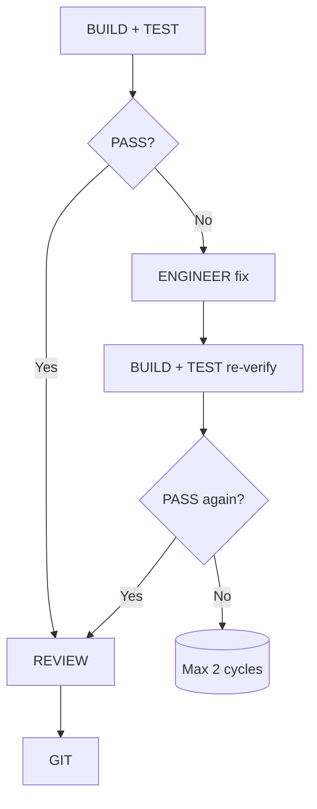
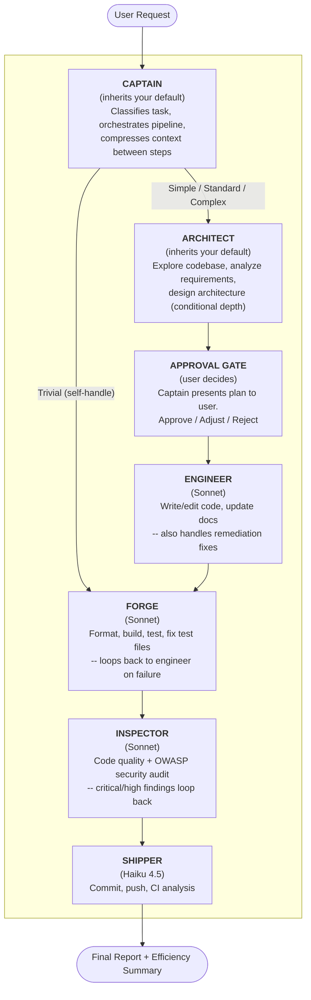

# AI Agent Team Pipeline for OpenCode

## What Is This?

A **6-agent orchestration system** for [OpenCode](https://opencode.ai) that replaces the default single-agent workflow with a structured, sequential pipeline. Instead of one AI agent doing everything (planning, coding, testing, reviewing, committing), a **Captain agent** delegates to 5 specialized subagents -- each with its own model tier, permissions, and focused prompt.

The result: higher code quality, lower token costs, and a predictable workflow that mirrors how a real engineering team operates.

> _Based on [san3jaya/agent-team-pipeline](https://github.com/san3jaya/agent-team-pipeline)._

## The Agent Roster

| Agent         | Role                                                            | Model Tier          | Cost   |
| ------------- | --------------------------------------------------------------- | ------------------- | ------ |
| **Captain**   | Orchestrator -- classifies tasks, delegates, compresses context | Inherits default \* | High   |
| **Architect** | Explores codebase, analyzes requirements, designs architecture  | Inherits default \* | High   |
| **Engineer**  | Writes/edits code, updates documentation                        | Mid (Sonnet 5)      | Medium |
| **Forge**     | Formats code, compiles assets, runs tests, fixes test files     | Mid (Sonnet 5)      | Medium |
| **Inspector** | Code quality review + OWASP security audit                      | Mid (Sonnet 5)      | Medium |
| **Shipper**   | Commits, pushes, analyzes CI pipelines                          | Light (Haiku 4.5)   | Low    |

\* The Captain and Architect deliberately omit a `model:` key in their frontmatter, so they inherit whatever model you have selected in OpenCode (typically Opus). These two do the reasoning-heavy work, so they follow your default rather than hardcoding a premium tier into the repo.

> [!NOTE]
> We can switch the LLM model to any desired option, including its reasoning capabilities.

## How to Use

### Prerequisites

- [OpenCode](https://opencode.ai) installed and configured with at least one provider
- Access to the models you want to use (Opus, Sonnet, Haiku 4.5) or adjust model assignments in the agent files to match your available models

### Installation

**Linux / macOS (one command):**

```bash
curl -sSL https://raw.githubusercontent.com/Racle/agent-team-pipeline/master/scripts/install.sh | bash
```

Or manually:

```bash
git clone https://github.com/Racle/agent-team-pipeline ~/.local/share/agent-team-pipeline
~/.local/share/agent-team-pipeline/scripts/install.sh
```

**Windows (PowerShell):**

```powershell
git clone https://github.com/Racle/agent-team-pipeline $env:LOCALAPPDATA\agent-team-pipeline
& "$env:LOCALAPPDATA\agent-team-pipeline\scripts\install.ps1"
```

**Updating:**

Linux/macOS:

```bash
agent-team-update
```

Windows:

```powershell
cd $env:LOCALAPPDATA\agent-team-pipeline; git pull; .\scripts\install.ps1
```

**Uninstalling:**

Linux/macOS:

```bash
~/.local/share/agent-team-pipeline/scripts/uninstall.sh
```

Windows:

```powershell
& "$env:LOCALAPPDATA\agent-team-pipeline\scripts\uninstall.ps1"
```

### Usage

> [!NOTE]
> The install script automatically sets `team-captain` as your default agent. If you installed manually, add `"default_agent": "team-captain"` to your `~/.config/opencode/opencode.json`.

Once installed, just use OpenCode normally. The Captain handles everything:

```
> Add a search feature to the users page

# Captain classifies the task (standard), then:
# 1. Invokes Architect to explore codebase and design the approach
# 2. Presents the plan to you for approval
# 3. Invokes Engineer to write the code
# 4. Invokes Forge to format, build, and test
# 5. Invokes Inspector for quality + security audit
# 6. Invokes Shipper to commit (if requested)
# -> Final report with efficiency summary
```

**Requesting a commit:**

```
> Add a search feature to the users page and commit it
```

The Captain will include the Git step and pass commit instructions to the Shipper.

**Resuming interrupted work (standard/complex tasks only):**

```
> resume
```

The Captain checks for `.opencode/resume.md` in the project root and offers to continue from where it left off.

**Trivial edits are fast:**

```
> Fix the typo in the header on the dashboard page
```

The Captain handles the edit directly (no Architect or Engineer needed), but still invokes the Forge to run tests.

### Custom Commands

The pipeline includes a `/format` command that runs only the Forge's formatting phase on your modified files. Use it when you want to format code without running the full pipeline:

```
/format
```

This will detect your project's formatters and run them on all git-dirty files. You can also pass specific files as arguments.

### How It Behaves

- **You talk to the Captain only.** The 5 subagents are hidden from the `@` autocomplete -- they're invoked automatically.
- **The Captain will ask clarifying questions** if your request is vague or has trade-offs. One question at a time, up to 10 total, framed as choices.
- **After planning, you approve the plan.** The Captain presents the Architect's plan (classification, files, steps, risks) and waits for your approval before writing any code. You can approve, adjust, or reject.
- **If something fails**, the Captain retries or routes to the Engineer for fixes. It will never silently swallow errors.
- **The final report** tells you exactly what happened: steps run, steps skipped, issues found, invocation count, and efficiency breakdown.

### Customization

**Adjust pipeline budgets** -- Edit the Pipeline Budget section in `team-captain.md` if the default caps (trivial: 3, simple: 6, standard: 8, complex: 12) are too tight or too loose for your workflow.

**Add project-specific skills** -- Place skill files in your project's `.opencode/agents/skills/` directory. The agents will pick them up automatically for technology-specific guidance (e.g., Laravel, React, Rust conventions).

**Change model tiers** -- Swap models in agent frontmatter to match your budget. For example, use Sonnet everywhere for lower cost, or Opus everywhere for maximum quality. Note that `team-captain.md` and `team-architect.md` have no `model:` key on purpose -- they follow whatever model you have selected in OpenCode. Add a `model:` line to either if you want to pin them explicitly.

**Optional: Persistent memory** -- If you use a persistent memory MCP plugin like [Engram](https://github.com/Gentleman-Programming/engram), the Captain will automatically query prior session context before invoking the Architect. This reduces redundant codebase exploration on follow-up tasks, saving tokens. The pipeline works fully without it — no configuration needed if you don't use memory tools.

## The Pipeline

Every task flows through a strict sequential pipeline. The Captain never skips ahead -- each step must complete before the next begins.

```
1. PLAN+EXPLORE  -> Architect       Understand the problem, explore code, design solution
── USER APPROVAL GATE ──            Present plan to user, wait for approval
2. IMPLEMENT     -> Engineer        Write the code following the plan
3. BUILD+TEST    -> Forge           Format, build, run tests, fix test files
4. REVIEW        -> Inspector       Quality + security audit
5. GIT           -> Shipper         Commit, push, check CI
```

Tasks are classified into 4 tiers (trivial, simple, standard, complex), and the pipeline adapts -- trivial tasks skip the Architect (the Captain handles them directly), and review may be skipped for trivial changes based on the Architect's recommendation.

After the Architect delivers its plan, the Captain **always presents the plan to the user for approval** before any code is written. The user can approve, adjust, or reject. This prevents wasted tokens on wrong implementations and keeps the user in control of architectural decisions.

When tests fail or the reviewer finds critical issues, a **remediation loop** kicks in: failures route back to the Engineer for fixes, then re-run validation. The Captain never fixes code itself -- it purely orchestrates.

### Remediation Flow



> For the design philosophy, cost optimization strategies, and evolution from single-agent to 6-agent pipeline, see [docs/DESIGN.md](docs/DESIGN.md).

## Architecture Overview


